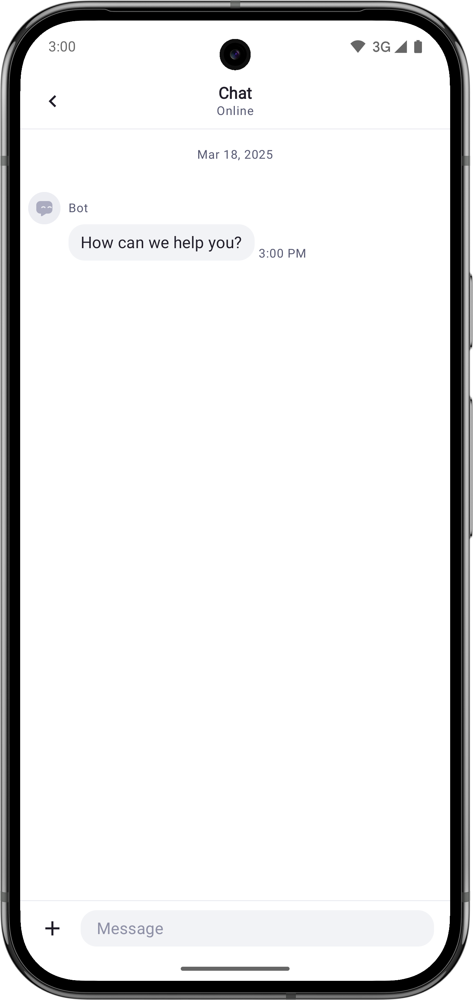
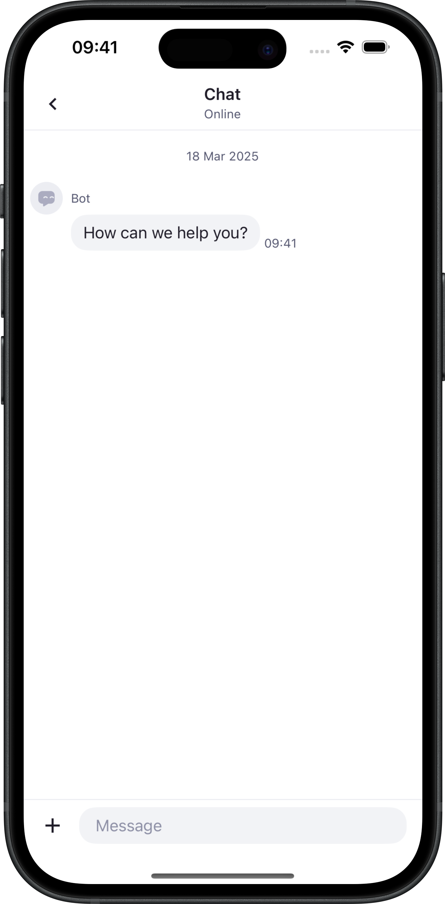

# Voximplant React Native Kit Chat SDK

The Voximplant React Native Kit Chat SDK allows you to add in-app messaging into your React Native application with 
a ready-to-go user experience. Explore our documentation and learn how to add an interface into your app, customize colors
and strings so that the messaging user interface looks natural. Enhance your user experience with push notifications, 
customer data, and other features.

Supported languages: English, Spanish, Portuguese, Russian.

 

## Supported React Native Versions

React Native >= 0.74

## Getting started

To get started, you need to register a Voximplant Kit account and configure a mobile channel.
- Create and setup a mobile channel - [guide](https://voximplant.com/kit/docs/setup/conversations/channels/mobilechat).
- Upload push notification certificates - [guide](https://voximplant.com/kit/docs/setup/conversations/pushcertificates).

### Install 

```sh
npm install @voximplant/react-native-kit-chat
```
or 
```shell
yarn add @voximplant/react-native-kit-chat
```
#### iOS

Add `NSCameraUsageDescription` and `NSPhotoLibraryAddUsageDescription` descriptions to your application's Info.plist
```xml
<key>NSPhotoLibraryAddUsageDescription</key>
<string>This will let you save photos to the gallery.</string>
<key>NSCameraUsageDescription</key>
<string>This will let you take photos.</string>
```
These entries allow the app to access the camera and gallery for sending attachments in the chat.

Modify the `AppDelegate` file to set the rootViewController to the SDK.

RN 0.80 swift example
```swift
import react_native_voximplant_kit_chat

func application(
    _ application: UIApplication,
    didFinishLaunchingWithOptions launchOptions: [UIApplication.LaunchOptionsKey: Any]? = nil
  ) -> Bool {
    
    ....
    
    window = UIWindow(frame: UIScreen.main.bounds)
//    Replace the default RN implementation for the rootViewController setup with the code below
//    factory.startReactNative(
//      withModuleName: "YourAppName",
//      in: window,
//      launchOptions: launchOptions
//    )  

    let rootView = factory.rootViewFactory.view(withModuleName: "YourAppName",
                                                initialProperties: nil,
                                                launchOptions: launchOptions)
    let rootViewController = delegate.createRootViewController()
    let navController = UINavigationController(rootViewController: rootViewController)
    navController.setNavigationBarHidden(true, animated: false)
    delegate.setRootView(rootView, toRootViewController: rootViewController)
    window?.rootViewController = navController
    window?.makeKeyAndVisible()
    
    RNVIKitChatImpl.rootViewController = rootViewController
    ....
  }
```

RN 0.74 Objective-C example
```objc
#import "RNVIKitChat.h"

@implementation AppDelegate

// Add these methods
- (UIViewController *)createRootViewController {
  UIViewController *rootViewController = [UIViewController new];
  UINavigationController *navController = [[UINavigationController alloc] initWithRootViewController:rootViewController];
  [navController setNavigationBarHidden:YES animated:NO];
  [RNVIKitChat configureNavigationWithRootViewController:rootViewController];
  return navController;
}

- (void)setRootView:(UIView *)rootView toRootViewController:(UIViewController *)rootViewController {
  UINavigationController *navController = (UINavigationController *)rootViewController;
  navController.topViewController.view = rootView;
}
@end
```

### Usage

#### Initialization

`KitChat` is the main class of the SDK that provides access to its functionality. You should initialize it with
your mobile channel credentials and the unique customer identifier before opening the chat.

```ts
import { KitChat } from '@voximplant/react-native-kit-chat';

let kitChat = new KitChat();
await kitChat.initialize(region, channelUuid, token, clientId);
await kitChat.openChat();
```

#### Customization

The SDK offers an API to customize colors, icons, and strings. Customization should be applied before navigating 
to the chat screen.

**Color**

Colors customization example
```ts
import { KitChat, KitColorScheme } from '@voximplant/react-native-kit-chat';

let colorScheme: KitColorScheme = {
  brand: "#f542a4",
};
let customization: KitCustomization = {
  colorScheme: this.colorScheme
};
let kitChat = new KitChat();
kitChat.applyCustomization(customization);
```

**Icons on iOS**

Custom icons should be added to [Images.xcassets](https://developer.apple.com/documentation/xcode/adding-images-to-your-xcode-project) 
in the application Xcode project.

Icons customization example on iOS
```ts
let senderIconsIos: KitSenderIconsIos = {
  agent: "myAgentIcon",
  bot: "myBotIcon",
};
let iconsIos: KitCustomizableIconsIos = {
  senders: senderIcons,
};
let customization: KitCustomization = {
  customizableIconsIos: iconsIos
};
kitChat.applyCustomization(customization);
```

**Icons on Android**

Place the icons specified below into the application's drawable resources (<project_dir>/android/app/src/main/res/drawable). 

This will override the default icons provided by the SDK during the app build.

| Key                                      | Description                                                                       |
|------------------------------------------|-----------------------------------------------------------------------------------|
| ic_kit_action_back_s.xml                 | Icon that represents the action to go back on the navigation bar                  |
| ic_kit_action_close_s.xml                | Icon that represents the action to close the selection mode on the navigation bar |
| ic_kit_action_copy_s.xml                 | Icon that represents the action to copy text in a message                         |
| ic_kit_action_save_s.xml                 | Icon that represents the action to save an attachment file                        |
| ic_kit_add_attachments_s.xml             | Icon that represents the action to add attachments to an outbound message         |
| ic_kit_attachment_download_s.xml         | Icon that represents the action to download an attachment                         |
| ic_kit_attachment_preview_document_s.xml | Icon that represents a placeholder for a document attachment in a message         |
| ic_kit_attachment_preview_media_s.xml    | Icon that represents a placeholder for a media attachment in a message            |
| ic_kit_avatar_agent_xs.xml               | Icon that represents the agent’s default avatar                                   |
| ic_kit_avatar_bot_xs.xml                 | Icon that represents the bot’s default avatar                                     |
| ic_kit_chat_notification_message.xml     | Icon that represents a new message in a notification                              |
| ic_kit_chat_notification_upload.xml      | Icon that represents the upload in notification                                   |
| ic_kit_error_xxs.xml                     | Icon that represents the outbound message error state                             |
| ic_kit_picker_camera_s.xml               | Icon that represents the action to the open camera                                |
| ic_kit_picker_file_s.xml                 | Icon that represents the action to open the document picker                       |
| ic_kit_picker_media_s.xml                | Icon that represents the action to open the media picker                          |
| ic_kit_remove_s.xml                      | Icon that represents the action to remove an attached file in an outbound message |
| ic_kit_scroll_down_s.xml                 | Icon that represents the action to scroll the page to the latest messages         |
| ic_kit_send_message_s.xml                | Icon that represents the action to send a message                                 |
| ic_kit_success_xxs.xml                   | Icon to highlight success states                                                  |
| ic_kit_warning_s.xml                     | Icon that represents the attachment error state                                   |

**Strings on iOS**
```ts
let stringsIos: KitCustomizableStringsIos = {
  chatTitle: "Chat",
};
let customization: KitCustomization = {
  customizableStringsIos: stringsIos
};
kitChat.applyCustomization(customization);
```

**Strings on Android**

Override the strings in the application resources (<project_dir>/android/app/src/main/res/values) with specified names. 

| Key                                         | Description                                                                                               |
|---------------------------------------------|-----------------------------------------------------------------------------------------------------------|
| kit_attachments_pick_file                   | Localized strings configuration for the document picker action                                            |
| kit_attachments_pick_media                  | Localized strings configuration for the media picker action                                               |
| kit_attachments_take_photo                  | Localized strings configuration for the camera picker action                                              |
| kit_chat_title                              | Localized string that represents the chat title                                                           |
| kit_connection_state_connecting             | Localized string for the connecting state                                                                 |
| kit_connection_state_offline                | Localized string for the offline state                                                                    |
| kit_connection_state_online                 | Localized string for the online state                                                                     |
| kit_copied                                  | Localized string for the notice that text has been copied                                                 |
| kit_error_file_action_access                | Localized string for the file access error action                                                         |
| kit_error_file_action_open                  | Localized string for the file open error action                                                           |
| kit_error_file_action_save                  | Localized string for the file save error action                                                           |
| kit_error_file_limit                        | Localized string for the notice that the file attachments limit for an outbound message has been exceeded |
| kit_error_send_message_invalid_files        | Localized string for invalid files in an outbound message                                                 |
| kit_error_validation_file_invalid           | Localized string for an invalid file                                                                      |
| kit_error_validation_file_invalid_extension | Localized string for an invalid file extension                                                            |
| kit_error_validation_file_invalid_size      | Localized string for an invalid file size                                                                 |
| kit_error_validation_files_invalid          | Localized string for invalid files                                                                        |
| kit_file_saved                              | Localized string indicating that a file has been saved                                                    |
| kit_file_saved_to_downloads                 | Localized string indicating that a file has been saved to the Downloads directory                         |
| kit_notification_channel_chat_description   | Localized string that represents the chat notification channel description                                |
| kit_notification_channel_chat_name          | Localized string that represents the chat notification channel name                                       |
| kit_notification_channel_upload_description | Localized string that represents the upload notification channel description                              |
| kit_notification_channel_upload_name        | Localized string that represents the upload notification channel name                                     |
| kit_notification_new_message_content_text   | Localized string that represents the description text for a new inbound message                           |
| kit_notification_new_message_title          | Localized string that represents the title text for a new inbound message                                 |
| kit_placeholder_message                     | Localized string that represents placeholder text for an outbound message                                 |
| kit_sender_display_name_agent_unnamed       | Localized string for the agent’s default display name                                                     |
| kit_sender_display_name_bot                 | Localized string for the agent’s default display name                                                     |
| kit_unit_bytes                              | Localized string for the bytes unit                                                                       |
| kit_unit_kilobytes                          | Localized string for the kilobytes unit                                                                   |
| kit_unit_megabytes                          | Localized string for the megabytes unit                                                                   |
| kit_notification_upload_progress_title      | Localized plural string for the upload progress title in a notification                                   |


## License
Apache 2.0
